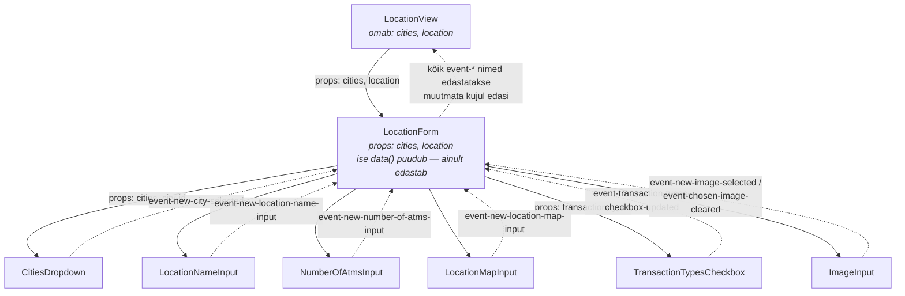

# Vue andmevoo diagramm: kes kellega suhtleb

See fail selgitab **props alla / events üles** põhimõtet meie projekti päris näite
peal — asukoha lisamise vormi (`LocationView` → `LocationForm` → lapsed) — nii, et
seda oleks lihtne meeles pidada.

---

## Meelespea ühe lausega

> **Andmed liiguvad alla propidena, muudatused liiguvad üles sündmustena (`$emit`).**

- **Prop (`:nimi="..."`)** — vanem annab lapsele andmed. Laps neid **ei tohi** ise muuta.
- **Event (`@event-...`)** — laps teatab vanemale "kasutaja tegi midagi". Vanem otsustab, mida andmetega teha.
- Keegi ei muuda kunagi otse teise komponendi andmeid — ainult **oma** `data()`.

---

## Diagramm: "Lisa asukoht" vormi tegelik struktuur



**Kuidas lugeda:**
- Pidevad nooled (`-->`) alla = **props**.
- Punktiirnooled (`-.->`) üles = **events**.

---

## Kolm rolli, mis igas komponendis korduvad

| Roll | Kes projektis | Mida teeb |
|---|---|---|
| **Omanik (state owner)** | `LocationView` | Hoiab päris `data()`-t (`location`, `cities`), teeb API päringuid, otsustab mida event'i saabudes muuta |
| **Vahendaja (pass-through)** | `LocationForm` | Ei oma ise andmeid — ainult **jagab propid laiali** lastele ja **kuulab sündmused kokku**, saadab need muutmata kujul edasi vanemale |
| **Lehtkomponent (leaf)** | `CitiesDropdown`, `LocationNameInput`, `NumberOfAtmsInput`, `LocationMapInput`, `TransactionTypesCheckbox`, `ImageInput` | Kuvab UI väljal, kuulab kasutaja tegevust (`@change`, `@click`), saadab `$emit`-iga sündmuse üles — ei tea midagi vanema andmestruktuurist |

---

## Näide koodis: sama asi, mis diagrammil

**Lehtkomponent saadab sündmuse üles** (`CitiesDropdown.vue`):
```js
this.$emit('event-new-city-selected', selectedCityId)
```

**Vahendaja (`LocationForm.vue`) ei tea, mida sündmusega peale hakata — lihtsalt edastab:**
```html
<CitiesDropdown
  :cities="cities"
  @event-new-city-selected="$emit('event-new-city-selected', $event)"
/>
```

**Omanik (`LocationView.vue`) otsustab, mida andmetega teha:**
```html
<LocationForm
  :cities="cities"
  :location="location"
  @event-new-city-selected="location.cityId = $event"
/>
```

---

## Meelespea reegel vahendaja (pass-through) komponendi äratundmiseks

Kui komponendi `<script>` osas näed:
- **props** — aga **pole** `data()`-t (või on ainult tühine)
- **emits**, mille nimed on **täpselt samad**, mis lastelt tulevad sündmused
- template'is iga lapse `@event-...` kuulaja sisu on **`$emit('sama-nimi', $event)`**

siis on tegu **vahendajaga** — ta ise ei salvesta midagi, vaid ehitab UI struktuuri ja
tõstab sündmused ühe taseme võrra üles. Nii on `LocationForm` üles ehitatud.
