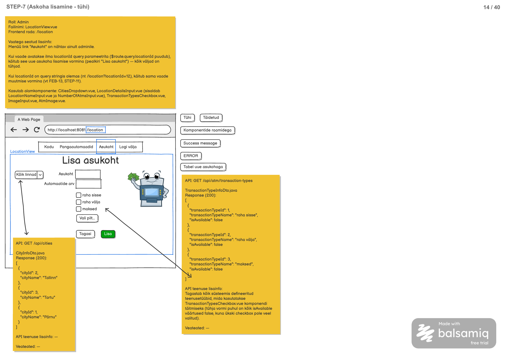

# Tehingutüüpide nimekirja päring

**Teenus:** `GET /api/atm/transaction-types`

**Kasutav vaade:** `LocationView.vue` (`/location`)



## Sisend

Teenusel puuduvad sisendid — ei path variable't, ei query parameetreid ega request body't.

## Väljund

**Response (200 OK):** massiiv `TransactionTypeDto` objekte, mis sisaldab kõiki süsteemis defineeritud tehingutüüpe.

```json
[
  {
    "transactionTypeId": 2,
    "transactionTypeName": "raha välja",
    "isAvailable": false
  },
  {
    "transactionTypeId": 1,
    "transactionTypeName": "raha sisse",
    "isAvailable": false
  },
  {
    "transactionTypeId": 3,
    "transactionTypeName": "maksed",
    "isAvailable": false
  }
]
```

`isAvailable` väärtus tuleb tühja vormi kontekstis alati `false`, kuna ükski checkbox pole veel valitud.

## Eesmärk

Frontendis kasutatakse asukoha lisamise vormil (`LocationView.vue`, `/location` ilma `locationId` query parameetrita) komponenti `TransactionTypesCheckbox.vue`, mis kuvab kasutajale kõik võimalikud tehingutüübid (raha sisse, raha välja, maksed) checkboxidena, et admin saaks valida, millised tehingutüübid on uues asukohas saadaval.

Selleks, et komponent teaks, milliseid checkboxe üldse kuvada, peab backend pakkuma teenuse, mis tagastab kõik süsteemis defineeritud tehingutüübid — sõltumata konkreetsest asukohast. Uue (tühja) vormi puhul on kõik tehingutüübid vaikimisi mittevalitud (`isAvailable: false`).

## Seotud andmebaasi tabelid

Vt `docs/database/2_create.sql`.

**`transaction_type`** — süsteemis defineeritud tehingutüübid:

```sql
CREATE TABLE transaction_type (
    id serial NOT NULL,
    name varchar(255) NOT NULL,
    CONSTRAINT transaction_type_pk PRIMARY KEY (id)
);
```

Reaalsed andmed (vt `docs/database/3_import.sql`):

| id | name       |
|----|------------|
| 1  | raha sisse |
| 2  | raha välja |
| 3  | maksed     |

See teenus loeb andmed otse `transaction_type` tabelist ega puuduta `location_transaction_type` seostabelit (see on asukohapõhine ja kasutusel teistes teenustes, nt asukoha muutmise vormi täitmisel).

## Veaolukorrad

| Olukord | Status code | Response body |
|---|---|---|
| Ootamatu serveripoolne viga (nt andmebaasiühenduse tõrge) | 500 Internal Server Error | Standardne vea response body (vastavalt projekti globaalsele error handler'ile) |

Muid veaolukordi teenusel ei ole, kuna sisendeid ei kontrollita ja teenus ei sõltu kasutaja rollist ega muudest tingimustest.

## Vastuvõtu kriteeriumid

- [ ] Loodud on endpoint `GET /api/atm/transaction-types`.
- [ ] Endpoint tagastab HTTP staatuskoodiga `200 OK` kõik `transaction_type` tabelis olevad kirjed.
- [ ] Response body on JSON massiiv `TransactionTypeDto` objektidest väljadega `transactionTypeId`, `transactionTypeName`, `isAvailable`.
- [ ] `isAvailable` väärtus on vastuses alati `false` (teenus ei tea asukohast, seega ei saa määrata, kas tehingutüüp on kuskil saadaval).
- [ ] Tehingutüübid tagastatakse `transaction_type.name` järgi kahanevas (DESC) järjekorras.
- [ ] Kui andmebaasis pole ühtegi tehingutüüpi, tagastatakse `200 OK` koos tühja massiiviga `[]`.
- [ ] Ootamatu serveripoolse vea korral tagastatakse `500 Internal Server Error`.
- [ ] Teenuse jaoks on kirjutatud automaattestid (nii õnnestunud päringu kui ka tühja tulemuse juhtumi kohta).
