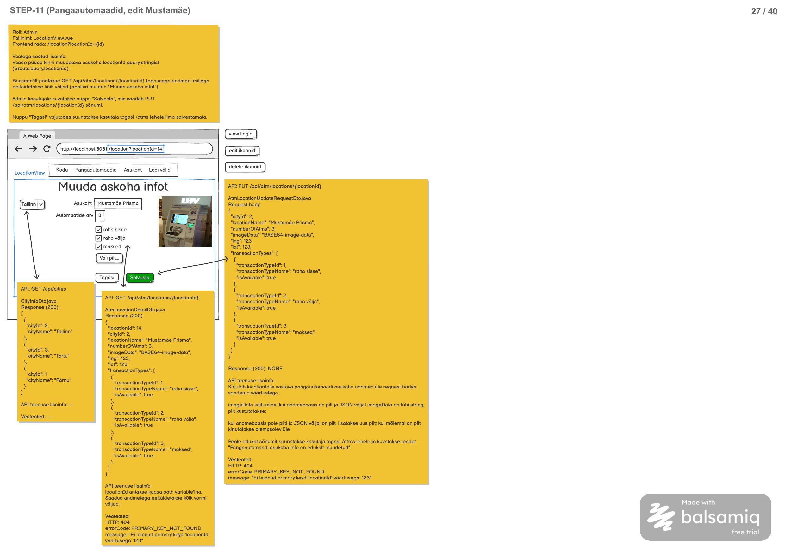

# Asukoha info muutmine

**Teenus:** `PUT /api/atm/locations/{locationId}`

**Kasutav vaade:** `LocationView.vue` (`/location?locationId={id}`)



## Sisend

**Path variable:** `locationId` (Integer) — selle asukoha ID, mille andmeid muudetakse.

**Request body:** `LocationDto` objekt.

```json
{
  "cityId": 2,
  "locationName": "Mustamäe Prisma",
  "numberOfAtms": 3,
  "imageData": "BASE64-image-data",
  "lng": 123,
  "lat": 123,
  "transactionTypes": [
    {
      "transactionTypeId": 1,
      "transactionTypeName": "raha sisse",
      "isAvailable": true
    },
    {
      "transactionTypeId": 2,
      "transactionTypeName": "raha välja",
      "isAvailable": true
    },
    {
      "transactionTypeId": 3,
      "transactionTypeName": "maksed",
      "isAvailable": true
    }
  ]
}
```

> **Märkus andmete kohta:** Mockupis kasutatud näidis (`locationId=14`, `cityId=2`, "Mustamäe Prisma") ei vasta ühelegi kirjele failis `docs/database/3_import.sql` (seal on ainult `locationId` 1–3, ja `cityId=2` on Tallinn, mitte Mustamäe linnaosa — linnaosad pole üldse `city` tabelis eraldi modelleeritud, `cityId` viitab linnale, mitte linnaosale). JSON näidis ülal kasutab seetõttu PDF-i enda struktuuri ja väärtusi täpselt, aga testimisel/vastuvõtukriteeriumite kontrollimisel tuleb kasutada päris andmebaasi seisu, nt `locationId=1` ("Sikupilli Prisma", `cityId=2` Tallinn).
>
> `transactionTypeName` väli request body's ei ole kohustuslik sisendina — backend ei pea seda kasutama (vt "API teenuse lisainfo" allpool).

**`transactionTypes` väljade tähendus sisendis:**
- Massiiv sisaldab kõiki süsteemi tehingutüüpe (samamoodi nagu väljundis).
- `isAvailable: true` tähendab, et see tehingutüüp peab pärast salvestamist olema asukohas saadaval (kirje `location_transaction_type` tabelis peab eksisteerima).
- `isAvailable: false` tähendab, et see tehingutüüp ei tohi pärast salvestamist asukohas saadaval olla (kirjet `location_transaction_type` tabelis ei tohi olla).

**`imageData` väljal on kolm võimalikku käitumist (vt "imageData käitumine" allpool):**
1. Pilt kustutatakse — kui andmebaasis on `location_image` kirje ja JSON väljal `imageData` on tühi string.
2. Pilt lisatakse — kui andmebaasis pilti pole ja JSON väljal on pilt.
3. Pilt kirjutatakse üle — kui mõlemal (andmebaasis ja JSON-is) on pilt.

## Väljund

**Response (200 OK):** tühi vastus (`NONE`), sisu puudub. Staatuskood ise kinnitab, et muutmine õnnestus.

Peale edukat salvestamist suunatakse kasutaja frontendis tagasi `/atms` lehele ja kuvatakse teade "Pangaautomaadi asukoha info on edukalt muudetud."

## Eesmärk

Frontendis kasutatakse asukoha muutmise vormil (`LocationView.vue`, `/location?locationId={id}`), kus admin näeb eeltäidetud vormi (vt seotud päringut `GET /api/atm/locations/{locationId}`) ja saab muuta linna, asukoha nime, automaatide arvu, pilti ning tehingutüüpide saadavust checkbox'ide kaudu (`TransactionTypesCheckbox.vue`).

Nupp "Salvesta" saadab kogu vormi hetkeseisu `PUT` päringuna. Teenus kirjutab `locationId`-le vastava pangaautomaadi asukoha andmed üle request body's saadetud väärtustega — nii põhiandmed (`city`, `name`, `numberOfAtms`, `lng`, `lat`) kui ka seotud tehingutüüpide saadavuse (`location_transaction_type` kirjed) ja pildi (`location_image` kirje, vastavalt "imageData käitumine" reeglitele).

## Seotud andmebaasi tabelid

Vt `docs/database/2_create.sql`.

**`location`** — pangaautomaadi asukoht, mida uuendatakse:

```sql
CREATE TABLE location (
    id serial  NOT NULL,
    city_id int  NOT NULL,
    name varchar(255)  NOT NULL,
    number_of_atms int  NOT NULL,
    status char(1)  NOT NULL,
    lng numeric(10,7),
    lat numeric(10,7),
    CONSTRAINT location_pk PRIMARY KEY (id)
);
```

**`city`** — linn, millele asukoht kuulub (FK `location.city_id`), muudetakse `cityId` väärtuse kaudu:

```sql
CREATE TABLE city (
    id serial  NOT NULL,
    name varchar(255)  NOT NULL,
    CONSTRAINT city_pk PRIMARY KEY (id)
);
```

**`location_image`** — asukoha valikuline pilt (1:0..1 seos `location`-ga), mida lisatakse/kustutatakse/uuendatakse vastavalt `imageData` käitumisele:

```sql
CREATE TABLE location_image (
    id serial  NOT NULL,
    location_id int  NOT NULL,
    data bytea  NOT NULL,
    CONSTRAINT location_image_pk PRIMARY KEY (id)
);
```

**`transaction_type`** — süsteemis defineeritud tehingutüübid (otsingutabel, ei muudeta):

```sql
CREATE TABLE transaction_type (
    id serial  NOT NULL,
    name varchar(255)  NOT NULL,
    CONSTRAINT transaction_type_pk PRIMARY KEY (id)
);
```

**`location_transaction_type`** — seostabel, mida uuendatakse vastavalt sisendi `transactionTypes` massiivi `isAvailable` väärtustele (kirjed lisatakse/kustutatakse):

```sql
CREATE TABLE location_transaction_type (
    id serial  NOT NULL,
    location_id int  NOT NULL,
    transaction_type_id int  NOT NULL,
    CONSTRAINT location_transaction_type_pk PRIMARY KEY (id)
);
```

Näidisandmed enne muutmist (`docs/database/3_import.sql`):

| location.id | location.name    | city_id | number_of_atms | location_transaction_type (transaction_type_id) | location_image |
|-------------|-------------------|---------|-----------------|---------------------------------------------------|-----------------|
| 1           | Sikupilli Prisma  | 2 (Tallinn) | 5            | 1, 2, 3 (kõik saadaval)                            | puudub          |
| 2           | Tondi Selver      | 2 (Tallinn) | 2            | 1, 2 (maksed puudub)                               | puudub          |
| 3           | Jõe Prisma        | 3 (Tartu)   | 2            | 1, 2 (maksed puudub)                               | puudub          |

## imageData käitumine

Vaste PDF-i "API teenuse lisainfo" tekstile:

> Kui andmebaasis on pilt ja JSON väljal `imageData` on tühi string, pilt kustutatakse.
> Kui andmebaasis pole pilti ja JSON väljal on pilt, lisatakse uus pilt.
> Kui mõlemal on pilt, kirjutatakse olemasolev üle.

Konkreetsemalt:
- **Andmebaasis on `location_image` kirje + JSON `imageData` on tühi string (`""`)** → kustuta olemasolev `location_image` kirje.
- **Andmebaasis pole `location_image` kirjet + JSON `imageData` sisaldab andmeid** → loo uus `location_image` kirje.
- **Andmebaasis on `location_image` kirje + JSON `imageData` sisaldab andmeid** → uuenda olemasoleva `location_image` kirje `data` väärtust (kirjuta üle, mitte loo uut kirjet).
- **Andmebaasis pole `location_image` kirjet + JSON `imageData` on tühi string** → ei tehta midagi (jääb pildita).

`imageData` string ↔ `bytea` teisenduseks kasuta olemasolevat `StringBytesConverter`-it (vt `LocationImageMapper`, mida kasutatakse ka teenuses `GET /api/atm/locations/{locationId}` vastupidises suunas).

## Veaolukorrad

| Olukord | Status code | Response body |
|---|---|---|
| `locationId` väärtusega asukohta ei eksisteeri | 404 Not Found | `{ "message": "Ei leidnud primary keyd 'locationId' väärtusega: 123", "errorCode": "PRIMARY_KEY_NOT_FOUND" }` |
| Ootamatu serveripoolne viga (nt andmebaasiühenduse tõrge) | 500 Internal Server Error | Standardne vea response body (vastavalt projekti globaalsele error handler'ile) |

PDF ei maini täiendavaid veaolukordi (nt `cityId` või `transactionTypeId` kehtetuse kontrolli) — kui request body's viidatud `cityId` või mõni `transactionTypeId` ei eksisteeri andmebaasis, tekib sisuliselt sama 404 olukord (vt olemasolevat `getValidCity`/`getValidTransactionType` mustrit, mida kasutab ka `POST /api/atm/location` teenus).

404 juhtum vastab olemasolevale `PrimaryKeyNotFoundException` + `RestExceptionHandler` mustrile (vt nt `LocationService.getValidLocationBy`, `CityService.getValidCity`).

## Vastuvõtu kriteeriumid

- [ ] Loodud on endpoint `PUT /api/atm/locations/{locationId}` path variable'iga `locationId` ja request body'ga `LocationDto`.
- [ ] Kui `locationId`-ga asukoht eksisteerib, uuendatakse `location` kirje väljad (`city`, `name`, `numberOfAtms`, `lng`, `lat`) request body väärtustega ja tagastatakse `200 OK` tühja vastusega.
- [ ] `location_transaction_type` kirjed uuendatakse vastavalt request body `transactionTypes` massiivi `isAvailable` väärtustele: `true` → kirje peab eksisteerima, `false` → kirjet ei tohi olla.
- [ ] `imageData` käitumine vastab kolmele reeglile: tühi string + olemasolev pilt → kustuta; sisu + puuduv pilt → loo uus; sisu + olemasolev pilt → kirjuta üle.
- [ ] Kui `locationId`-ga asukohta ei eksisteeri, tagastatakse `404 Not Found` koos `errorCode: PRIMARY_KEY_NOT_FOUND`.
- [ ] Ootamatu serveripoolse vea korral tagastatakse `500 Internal Server Error`.
- [ ] Teenuse jaoks on kirjutatud automaattestid (õnnestunud uuenduse kohta — sh tehingutüüpide lisamine/eemaldamine ja kõik kolm `imageData` käitumise stsenaariumi — ning 404 juhtumi kohta).
